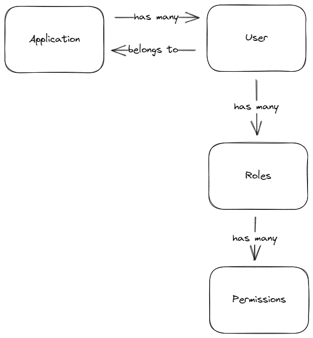

# Multi Tenant Role Based Access Control (RBAC) Authentication API

## Features
* Create an application
* Register a user for an application
* Login
* Create a role
* Assign a role to a user

* Check user permissions with a guard

## What are we using?
* [Drizzle ORM](https://github.com/drizzle-team/drizzle-orm)
* [Fastify](https://www.fastify.io/)
* [PostgreSQL](https://www.postgresql.org/)
* [TypeScript](https://www.typescriptlang.org/)

## Data structure

## Data flow

## Helpful files
* CMD - Installation commands
* api.json - Thunder Client collection

## Tips
* Infer the applicationId from the JWT where possible
* Include the applicationId in queries
